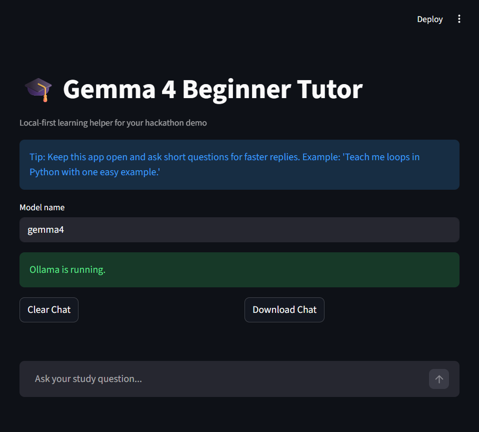
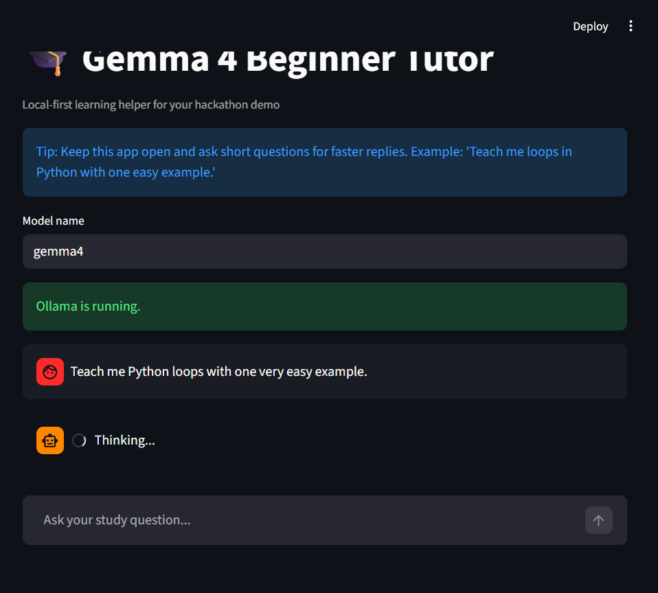

# Gemma 4 Beginner Tutor 

A local-first AI tutor built with Streamlit + Ollama + Gemma 4, designed for low-connectivity learning environments.

This project is optimized for hackathons and demos, with a focus on simplicity, clarity, and real-world impact.


##  Screenshots

### Home Screen


### Chat Interaction


##  Features

- Runs completely locally (no API key required)
- Beginner-friendly explanations with simple examples
- Chat-based learning interface
- Export chat history for revision or teacher feedback
- Smart fallback guidance if Ollama is not running
- Privacy-first design (no cloud prompt processing)

## 🛠 Tech stack

- Python 3.14+
- Streamlit
- Ollama
- Gemma 4 model (`gemma4:latest`)

## Quick Start

```bash
git clone https://github.com/eayub006-source/gemma4-beginner-tutor.git
cd gemma4-beginner-tutor
python -m pip install -r requirements.txt
ollama pull gemma4
python -m streamlit run app.py
```

Then open: [http://localhost:8501](http://localhost:8501)

## Installation

1. Verify Python:
   ```bash
   python --version
   ```
2. Install dependencies:
   ```bash
   pip install -r requirements.txt
   ```
3. Verify Ollama:
   ```bash
   ollama --version
   ```
4. Download model:
   ```bash
   ollama pull gemma4
   ```

> Note: `gemma4` is large (~9.6 GB), so first download can take time.

## Usage

- Run app:
  ```bash
  python -m streamlit run app.py
  ```
- Ask a study question in chat
- Use **Clear Chat** to reset
- Use **Download Chat** to export session text

## Troubleshooting

### `ERR_CONNECTION_REFUSED`
Streamlit is not running.

```bash
python -m streamlit run app.py
```

### Ollama is not ready
Start Ollama and verify model:

```bash
ollama serve
ollama list
```

If needed:

```bash
ollama pull gemma4
```

### `streamlit` command not found
Use module form:

```bash
python -m streamlit run app.py
```

### First reply is slow
Expected on first prompt while model loads into memory.

### Port `8501` already in use

```bash
python -m streamlit run app.py --server.port 8502
```

##  Why Gemma 4?

- Efficient local inference via Ollama
- Strong performance for beginner-level explanations
- Easy integration into local-first applications

##  Kaggle Submission (Judge-Friendly)

### Problem
Students in low-connectivity environments often cannot access reliable online tutoring tools.

### Solution
Gemma 4 Beginner Tutor provides local, privacy-preserving, beginner-friendly educational support through a simple chat interface.

### Architecture
- UI: Streamlit web app
- Inference: Ollama HTTP API (`127.0.0.1:11434`)
- Model: `gemma4:latest`
- State: Streamlit session state for chat history

### Demo checklist
- Launch app in under 30 seconds
- Ask one real educational prompt
- Show clear beginner-style response
- Export chat history as proof of utility
- Highlight local-first privacy and offline-friendly workflow

##  Demo

- Launch app in under 30 seconds
- Ask a question
- Export chat history

## Future improvements

- Voice input and output
- Multilingual learning mode
- Education-specific prompt templates
- PDF/image study material support
- Local analytics dashboard for learning progress

## License

This project is licensed under the MIT License. See `LICENSE`.
